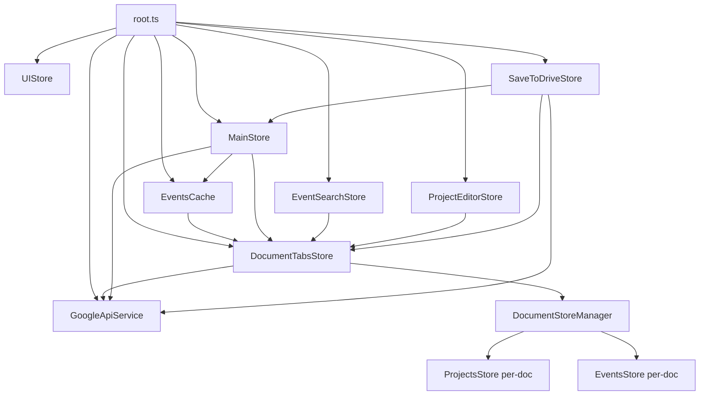

# План миграции: DocumentStoreManager v3

**Дата:** 12 апреля 2026 г.
**Автор:** AI Assistant
**Статус:** Черновик
**Связанные документы:**
- [document-store-manager-migration-plan-v2.md](./document-store-manager-migration-plan-v2.md) — предыдущая версия плана
- [document-store-manager-migration-plan-review.md](./document-store-manager-migration-plan-review.md) — обзор с замечаниями

---

## Отличия от плана v2

| Аспект | v2 | v3 (данный план) |
|--------|----|----|
| Feature toggle | Удаляется в Фазе 6 | **Удаляется в Фазе 4** — нет двухрежимной поддержки |
| `onChangeList` → `reaction()` | Замена на `reaction()` | **Сохраняется `onChangeList`** — проще, надёжнее, гарантированно срабатывает |
| `saveToLocalStorage` в Фазе 4 | Новый метод на `StorageService` | **Удалено** — дублирует `DocumentTabsStore.persistDocumentDataToLocalStorage()` |
| `applyContent` | `@deprecated` заглушка | **Перенесён в `DocumentTabsStore`** как `applyContentToActiveDocument()` |
| `StorageService` | Сохраняется с упрощением | **Удаляется целиком** — синхронизация уже в `session.state.syncStatus` |
| `MigrationService` | Не упоминается | **Удаляется целиком** — миграция давно выполнена |
| `normalizeMainStoreData` | В `StorageService` | **Перенесена в `DocumentTabsStore.utils.ts`** |
| Фазы 4–6 | Три отдельные фазы | **Объединены в Фазу 4** — невозможно убрать toggle без миграции всех потребителей |
| Фаза 7 (тестирование) | Отдельная фаза | Становится **Фазой 5** |

---

## Найденные проблемы в плане v2

### 1. `saveToLocalStorage` упоминается после удаления

В Фазе 0b метод `saveToLocalStorage()` был удалён из `StorageService`. Однако в Фазе 4 (Задача 4.1) план v2 снова вводит `saveToLocalStorage(documentId)` на `StorageService`. Это:
- Дублирует `DocumentTabsStore.persistDocumentDataToLocalStorage()`
- Создаёт путаницу — какой метод использовать?
- Не нужно — `DocumentTabsStore` уже сохраняет данные в пер-документные ключи

**Решение:** Не добавлять `saveToLocalStorage` в `StorageService`.

### 2. Замена `onChangeList` на `reaction()` нецелесообразна

План v2 предлагает заменить императивные колбэки `onChangeList` на декларативные `reaction()`. Анализ показывает, что это нецелесообразно:

- **`onChangeList` вызывается напрямую из мутаций** — гарантированно срабатывает при каждом изменении
- **`reaction()` требует правильного выбора отслеживаемых данных** — если забыть отслеживать поле, реакция не сработает; хрупкий механизм
- **С пер-документными сторами `onChangeList` просто настраивается** — `DocumentStoreManager` устанавливает его при создании каждой пары сторов
- **`reaction()` добавляет сложность** — нужно управлять `dispose()`, отслеживать правильные данные, обрабатывать первый запуск

**Решение:** Сохранить `onChangeList`, настроить его через `DocumentStoreManager` на каждую новую пару сторов.

### 3. `applyContent` можно сохранить и перенести

Метод `applyContent()` в `StorageService` выполняет:
1. Валидацию и нормализацию данных через `normalizeMainStoreData()`
2. Применение данных к сторам (`projectsStore.init()`, `eventsStore.init()`)
3. Обновление флагов синхронизации

Единственный внешний потребитель — `CalendarIconBar.handleChooseRemoteVersion()`. После удаления `StorageService` логику `applyContent` нужно перенести.

**Решение:** Перенести в `DocumentTabsStore` как `applyContentToActiveDocument()`, который:
- Нормализует контент через `normalizeMainStoreData()`
- Обновляет пер-документные сторы через `DocumentStoreManager.updateStoresData()`
- Обновляет `session.data` и `session.state`

### 4. Feature toggle нужно удалить раньше

Поддержка двух режимов (`usePerDocumentStores = true/false`) требует:
- Условных веток в каждом методе `DocumentTabsStore`
- Передачи `uiStore` в конструктор `DocumentTabsStore`
- Дублирования логики применения данных

Это усложняет код и затрудняет отладку. Поскольку Фазы 0a–3 уже выполнены и `DocumentStoreManager` работает, можно сразу переключиться на новый режим.

**Решение:** Удалить toggle в Фазе 4, объединив миграцию всех потребителей в одну фазу.

### 5. `StorageService` можно удалить целиком

Анализ показывает, что `StorageService` после миграции не нужен:

| Метод | Судьба |
|-------|--------|
| `applyContent()` | → `DocumentTabsStore.applyContentToActiveDocument()` |
| `getContentToSave()` | → `DocumentStoreManager.getDocumentDataForSave()` |
| `normalizeMainStoreData()` | → утилита в `DocumentTabsStore.types.ts` или рядом с `DocumentTabsStore` |
| `desyncWithStorages()` | → не нужен, `updateActiveDocumentData()` уже ставит `isDirty` и `syncStatus` |
| `markGoogleDriveSynced()` | → не нужен, `DocumentTabsStore.saveActiveDocument()` уже ставит `syncStatus = 'synced'` |
| `isSyncWithLocalstorage` | → не читается ни одним UI-компонентом (0 ссылок в `.tsx`) |
| `isSyncWithGoogleDrive` | → не читается ни одним UI-компонентом (0 ссылок в `.tsx`) |

Флаги синхронизации `isSyncWithLocalstorage`/`isSyncWithGoogleDrive` не используются в UI. Пер-документный статус синхронизации уже отслеживается через `session.state.syncStatus`.

---

## Текущее состояние кодовой базы

Фазы 0a–3 выполнены:

- ✅ `DocumentSessionStore` удалён
- ✅ Легаси-методы `StorageService` удалены (`saveToLocalStorage`, `init`, `resetToEmptyContent`)
- ✅ `ProjectsStore` перенесён в `src/6-entities/Projects/`
- ✅ `DocumentStoreManager` создан с `makeAutoObservable`, `dispose()`, `DocumentData`
- ✅ `DocumentTabsStore` интегрирован с `DocumentStoreManager` + feature toggle
- ✅ `EventsCache` мигрирован на `IEventsStoreProvider`

**Но:** `usePerDocumentStores = false` по умолчанию — приложение работает на глобальных сторах.

---

## Фаза 4: Полное переключение на пер-документные сторы

**Цель:** Удалить feature toggle и старый кодовый путь. Мигрировать все потребители глобальных сторов на пер-документные. Удалить `StorageService`.

**Ключевой принцип:** Нет двухрежимной поддержки. Убираем toggle и сразу мигрируем всё.

**Затрагиваемые файлы:**
- `src/1-app/Stores/UIStore.ts` — удалить `usePerDocumentStores`
- `src/6-entities/Document/model/DocumentTabsStore.ts` — удалить условные ветки, добавить `applyContentToActiveDocument()`, убрать `uiStore`
- `src/6-entities/Document/model/DocumentStoreManager.ts` — добавить поддержку `onChangeList`
- `src/6-entities/Document/model/DocumentTabsStore.utils.ts` — **НОВЫЙ** — перенести `normalizeMainStoreData()` и вспомогательные функции
- `src/1-app/Stores/MainStore.ts` — мигрировать на пер-документные сторы, удалить `MigrationService`
- `src/7-shared/services/StorageService.ts` — **УДАЛИТЬ**
- `src/1-app/Stores/MigrationService.ts` — **УДАЛИТЬ**
- `src/1-app/Stores/MigrationService.spec.ts` — **УДАЛИТЬ**
- `src/4-widgets/CalendarIconBar/CalendarIconBar.tsx` — заменить `storageService` на `documentTabsStore`
- `src/4-widgets/EventForm/EventForm.tsx` — заменить `eventsStore` на `documentTabsStore.activeEventsStore`
- `src/3-pages/Calendar/Calendar.tsx` — заменить `eventsStore` на `documentTabsStore.activeEventsStore`
- `src/3-pages/Calendar/CalendarEventItem.tsx` — заменить `eventsStore` на `documentTabsStore.activeEventsStore`
- `src/5-features/ProjectManager/ProjectList/ProjectList.tsx` — заменить `projectsStore` на `documentTabsStore.activeProjectsStore`
- `src/5-features/EventSearch/EventSearchStore.ts` — заменить `eventsStore` на `documentTabsStore`
- `src/5-features/ProjectManager/ProjectEditor/ProjectEditorStore.ts` — заменить `projectsStore` на `documentTabsStore`
- `src/1-app/root.ts` — удалить глобальные сторы, удалить `StorageService`, обновить порядок создания
- `src/1-app/Providers/StoreContext.ts` — удалить `projectsStore`, `eventsStore`, `storageService`
- `src/1-app/index.tsx` — удалить пропы
- `src/1-app/Stores/MainStore.ts` — удалить поля `projectsStore`, `eventsStore`, `storageService`

---

### Задача 4.1: Добавить поддержку `onChangeList` в `DocumentStoreManager`

**Файл:** `src/6-entities/Document/model/DocumentStoreManager.ts`

Добавить колбэки, которые устанавливаются на каждую новую пару сторов при создании:

```typescript
export class DocumentStoreManager {
    private stores: Map<DocumentId, DocumentStores> = new Map()
    private dataProvider: IDocumentDataProvider

    /** Колбэк при изменении событий в любом документе */
    private onEventsChanged?: (stores: DocumentStores) => void
    /** Колбэк при изменении проектов в любом документе */
    private onProjectsChanged?: (stores: DocumentStores) => void

    constructor(
        dataProvider: IDocumentDataProvider,
        callbacks?: {
            onEventsChanged?: (stores: DocumentStores) => void
            onProjectsChanged?: (stores: DocumentStores) => void
        }
    ) {
        this.dataProvider = dataProvider
        this.onEventsChanged = callbacks?.onEventsChanged
        this.onProjectsChanged = callbacks?.onProjectsChanged
        makeAutoObservable(this, {}, { autoBind: true })
    }

    getOrCreateStores(documentId: DocumentId): DocumentStores {
        const existing = this.stores.get(documentId)
        if (existing) return existing

        const data = this.dataProvider.getDocumentData(documentId)
        if (!data) throw new Error(`Document data not found: ${documentId}`)

        const projectsStore = new ProjectsStore()
        projectsStore.init(data.projectsList)

        const eventsStore = new EventsStore(projectsStore)
        eventsStore.init({
            completedList: data.completedList,
            plannedList: data.plannedList
        })

        const stores: DocumentStores = {
            projectsStore,
            eventsStore,
            documentId,
            isInitialized: true
        }

        // Устанавливаем колбэки на созданные сторы
        eventsStore.onChangeList = () => {
            this.onEventsChanged?.(stores)
        }
        projectsStore.onChangeList = () => {
            this.onProjectsChanged?.(stores)
        }

        this.stores.set(documentId, stores)
        return stores
    }

    // ... остальные методы без изменений ...
}
```

**Важно:** `updateStoresData()` вызывает `init()` на сторах, что триггерит `onChangeList`. Нужно учитывать это при загрузке данных — использовать `session.state.isLoading` как блокировку (см. Задачу 4.3).

**Критерий:** `DocumentStoreManager` принимает колбэки и устанавливает их на новые сторы.

---

### Задача 4.2: Перенести `normalizeMainStoreData` в `DocumentTabsStore.utils.ts` и удалить `StorageService`

**Файл:** `src/6-entities/Document/model/DocumentTabsStore.utils.ts` — **НОВЫЙ**

Перенести функцию `normalizeMainStoreData()` и вспомогательные типы/функции из `StorageService`:

```typescript
import type { ProjectData } from 'src/6-entities/Projects/ProjectsStore'
import type { EventsStoreData } from 'src/6-entities/Events/EventsStore'

/** Сериализуемая структура данных приложения */
export type MainStoreData = {
    projectsList: ProjectData[]
} & EventsStoreData

/** Узкий type-guard для проверки 'объектоподобного' значения */
function isRecord(value: unknown): value is Record<string, unknown> {
    return typeof value === 'object' && value !== null
}

/** Проверка структуры одного проекта в JSON-документе */
function isProjectData(value: unknown): value is ProjectData {
    if (!isRecord(value)) return false
    return typeof value.name === 'string'
        && typeof value.color === 'string'
        && typeof value.background === 'string'
}

/**
 * Нормализация и валидация входного контента документа.
 * При ошибке структуры бросает исключение с понятным текстом.
 */
export function normalizeMainStoreData(rawContent: unknown): MainStoreData {
    // ... без изменений, перенесено из StorageService ...
}
```

**Файл:** `src/7-shared/services/StorageService.ts` — **УДАЛИТЬ**

**Критерий:** `normalizeMainStoreData` доступна из `DocumentTabsStore.utils.ts`, `StorageService.ts` удалён.

---

### Задача 4.3: Обновить `DocumentTabsStore` — удалить toggle, убрать `uiStore`, добавить `applyContentToActiveDocument`

**Файл:** `src/6-entities/Document/model/DocumentTabsStore.ts`

#### 4.3.1: Удалить `uiStore` из конструктора

```typescript
// Было:
constructor(
    private readonly googleApiService: GoogleApiService,
    private readonly storageService: StorageService,
    private readonly uiStore: UIStore
)

// Стало:
constructor(
    private readonly googleApiService: GoogleApiService
)
```

`storageService` тоже удаляется — все вызовы `this.storageService.applyContent()` убираются.

#### 4.3.2: Удалить все условные ветки `if (this.uiStore.usePerDocumentStores)`

В каждом методе оставить только новый код:

**`openNewDocument`:**
```typescript
openNewDocument(name: string = 'Новый документ') {
    // ... создание session без изменений ...
    this.state.documents.set(id, session)
    this.state.documentOrder.push(id)
    this.state.activeDocumentId = id

    // Создаём сторы через DocumentStoreManager
    // Блокируем onChangeList на время загрузки
    session.state.isLoading = true
    this.documentStoreManager.getOrCreateStores(id)
    session.state.isLoading = false

    this.persistToLocalStorage()
    this.persistDocumentDataToLocalStorage(id)
}
```

**`openFromDrive`:**
```typescript
async openFromDrive(fileId: string, space?: 'drive' | 'appDataFolder') {
    // ... создание session без изменений ...

    try {
        // ... загрузка metadata и content без изменений ...

        // Обновляем сторы через менеджер
        loadedSession.state.isLoading = true  // блокируем onChangeList
        this.documentStoreManager.updateStoresData(id, {
            projectsList: loadedSession.data.projectsList,
            completedList: loadedSession.data.completedList,
            plannedList: loadedSession.data.plannedList
        })
        loadedSession.state.isLoading = false

        loadedSession.state.isDirty = false
        this.persistDocumentDataToLocalStorage(id)
        this.persistToLocalStorage()
    } catch (error: any) {
        // ... без изменений ...
    }
}
```

**`activateDocument`:**
```typescript
activateDocument(documentId: DocumentId) {
    const session = this.state.documents.get(documentId)
    if (!session) return

    this.state.activeDocumentId = documentId
    session.lastAccessedAt = Date.now()

    // Убеждаемся что сторы существуют (данные уже в памяти!)
    // Блокируем onChangeList чтобы не было ложного isDirty
    const previousLoadingState = session.state.isLoading
    session.state.isLoading = true
    this.documentStoreManager.getOrCreateStores(documentId)
    session.state.isLoading = previousLoadingState

    this.persistToLocalStorage()
}
```

**`closeDocument`:**
```typescript
closeDocument(documentId: DocumentId) {
    // ... удаление session из state без изменений ...

    // Удаляем сторы
    this.documentStoreManager.removeStores(documentId)

    if (this.state.activeDocumentId) {
        this.activateDocument(this.state.activeDocumentId)
    }

    this.removeDocumentDataFromLocalStorage(documentId)
    this.persistToLocalStorage()
}
```

**`restoreFromLocalStorage`:**
```typescript
async restoreFromLocalStorage(): Promise<boolean> {
    // ... восстановление метаданных без изменений ...

    // Загрузка данных каждого документа из localStorage
    for (const docSnapshot of snapshot.documents) {
        const dataJson = localStorage.getItem(`${DOCUMENT_DATA_PREFIX}${docSnapshot.id}`)
        if (dataJson) {
            try {
                const dataSnapshot = JSON.parse(dataJson) as DocumentDataSnapshot
                const session = this.state.documents.get(docSnapshot.id)!
                session.data = dataSnapshot.data

                // Создаём сторы (с блокировкой onChangeList)
                session.state.isLoading = true
                this.documentStoreManager.updateStoresData(docSnapshot.id, {
                    projectsList: session.data.projectsList,
                    completedList: session.data.completedList,
                    plannedList: session.data.plannedList
                })
                session.state.isLoading = false
            } catch (e) {
                console.error(`Failed to load data for document ${docSnapshot.id}:`, e)
            }
        }
    }

    return true
}
```

**`syncActiveDocumentWithDrive`:**
```typescript
// В блоке загрузки при отсутствии изменений:
session.data = parseDocumentContent(content)

session.state.isLoading = true  // блокируем onChangeList
this.documentStoreManager.updateStoresData(session.id, {
    projectsList: session.data.projectsList,
    completedList: session.data.completedList,
    plannedList: session.data.plannedList
})
session.state.isLoading = false

session.state.syncStatus = 'synced'
// ...
```

#### 4.3.3: Добавить `applyContentToActiveDocument()`

Новый метод для замены `storageService.applyContent()` — используется в `CalendarIconBar`:

```typescript
/**
 * Применить контент к активному документу.
 * Нормализует данные, обновляет сторы и сессию.
 * Используется при выборе удалённой версии при конфликте.
 */
applyContentToActiveDocument(content: unknown): void {
    const session = this.activeDocument
    if (!session) return

    const normalized = normalizeMainStoreData(content)

    // Обновляем данные сессии
    session.data = normalized

    // Обновляем сторы (с блокировкой onChangeList)
    session.state.isLoading = true
    this.documentStoreManager.updateStoresData(session.id, {
        projectsList: normalized.projectsList,
        completedList: normalized.completedList,
        plannedList: normalized.plannedList
    })
    session.state.isLoading = false

    session.state.syncStatus = 'synced'
    session.state.lastSyncedAt = Date.now()
    session.state.lastLoadedAt = Date.now()

    this.persistDocumentDataToLocalStorage(session.id)
    this.persistToLocalStorage()
}
```

#### 4.3.4: Добавить `getDocumentDataForSave()`

Удобный метод для замены `storageService.getContentToSave()`:

```typescript
/** Получить данные документа для сохранения */
getDocumentDataForSave(documentId?: DocumentId): DocumentData | null {
    const docId = documentId ?? this.state.activeDocumentId
    if (!docId) return null
    return this.documentStoreManager.getDocumentDataForSave(docId)
}
```

**Критерий:** `DocumentTabsStore` не зависит от `UIStore` и `StorageService`. Все условные ветки удалены. Добавлены `applyContentToActiveDocument()` и `getDocumentDataForSave()`.

---

### Задача 4.4: Мигрировать `MainStore`

**Файл:** `src/1-app/Stores/MainStore.ts`

#### 4.4.1: Удалить зависимости от глобальных сторов и `StorageService`

```typescript
// УДАЛИТЬ поля:
// projectsStore: ProjectsStore
// eventsStore: EventsStore
// private storageService: StorageService

// УДАЛИТЬ из конструктора:
// projectsStore, eventsStore, storageService
```

#### 4.4.2: Удалить `MigrationService`

**Файлы:**
- `src/1-app/Stores/MigrationService.ts` — **УДАЛИТЬ**
- `src/1-app/Stores/MigrationService.spec.ts` — **УДАЛИТЬ**

Миграция из однодокументной структуры в многодокументную уже давно выполнена. `MigrationService.migrateFromSingleDocument()` — холостая операция для всех существующих пользователей.

#### 4.4.3: Настроить `onChangeList` через `DocumentStoreManager`

```typescript
import { makeAutoObservable } from 'mobx'
import { EventsCache } from 'src/6-entities/EventsCache/EventsCache'
import { GoogleApiService } from 'src/7-shared/services/GoogleApiService'
import { PathSegment } from 'src/5-features/DriveFileList/model/DriveFileListStore'
import { Observable } from 'src/7-shared/libs/Observable/Observable'
import { DocumentTabsStore } from 'src/6-entities/Document/model'
import type { DocumentStores } from 'src/6-entities/Document/model/DocumentStoreManager.types'

export class MainStore {
    eventsCache: EventsCache

    private googleApiService: GoogleApiService
    private documentTabsStore: DocumentTabsStore

    driveExplorerPersistentState = new Map<string, { folderId: string; path: PathSegment[] }>()
    fileSavedNotifier = new Observable<void>()

    constructor(
        eventsCache: EventsCache,
        googleApiService: GoogleApiService,
        documentTabsStore: DocumentTabsStore
    ) {
        this.eventsCache = eventsCache
        this.googleApiService = googleApiService
        this.documentTabsStore = documentTabsStore

        this.driveExplorerPersistentState.set('drive', {
            folderId: 'root',
            path: [{ id: 'root', name: 'Мой диск' }]
        })
        this.driveExplorerPersistentState.set('appDataFolder', {
            folderId: 'appDataFolder',
            path: [{ id: 'appDataFolder', name: 'Раздел приложения' }]
        })

        makeAutoObservable(this)
    }

    init() {
        // MigrationService.migrateFromSingleDocument() — УДАЛЕНО, миграция давно выполнена

        // Настраиваем колбэки на изменения в пер-документных сторах
        this.documentTabsStore.setOnStoresChanged(
            // onEventsChanged
            (stores) => {
                stores.eventsStore.sort()
                this.eventsCache.init()

                const activeDoc = this.documentTabsStore.activeDocument
                if (activeDoc && !activeDoc.state.isLoading && activeDoc.id === stores.documentId) {
                    this.documentTabsStore.updateActiveDocumentData({
                        projectsList: stores.projectsStore.getList(),
                        ...stores.eventsStore.prepareToSave()
                    })
                }
            },
            // onProjectsChanged
            (stores) => {
                this.eventsCache.init()

                const activeDoc = this.documentTabsStore.activeDocument
                if (activeDoc && !activeDoc.state.isLoading && activeDoc.id === stores.documentId) {
                    this.documentTabsStore.updateActiveDocumentData({
                        projectsList: stores.projectsStore.getList(),
                        ...stores.eventsStore.prepareToSave()
                    })
                }
            }
        )

        this.eventsCache.init()
        this.googleApiService.initGapi()

        void this.googleApiService
            .waitForGapiReady()
            .then(() => {
                return this.documentTabsStore.restoreFromLocalStorage()
            })
            .catch(e => {
                console.error('DocumentTabsStore restore failed:', e)
            })
    }

    updateDriveExplorerPersistentState(space: string, folderId: string, path: PathSegment[]) {
        this.driveExplorerPersistentState.set(space, { folderId, path })
    }

    getDriveExplorerPersistentState(space: string): { folderId: string; path: PathSegment[] } {
        return this.driveExplorerPersistentState.get(space)!
    }
}
```

**Обоснование сохранения `onChangeList`:**
- Вызывается напрямую из мутаций — гарантированно срабатывает
- Не требует подбора отслеживаемых данных (как в `reaction()`)
- Не требует управления `dispose()`
- С пер-документными сторами просто настраивается через `DocumentStoreManager`

**Обоснование удаления `storageService.desyncWithStorages()`:**
- `updateActiveDocumentData()` уже устанавливает `isDirty = true` и `syncStatus = 'needs-sync'`
- Флаги `isSyncWithLocalstorage`/`isSyncWithGoogleDrive` не читаются ни одним UI-компонентом
- Пер-документный статус синхронизации полностью покрывается `session.state.syncStatus`

**Критерий:** `MainStore` не зависит от глобальных сторов и `StorageService`. `onChangeList` настроен через `DocumentTabsStore`.

---

### Задача 4.5: Мигрировать `CalendarIconBar`

**Файл:** `src/4-widgets/CalendarIconBar/CalendarIconBar.tsx`

#### 4.5.1: Заменить `storageService.getContentToSave()`

```typescript
// Было:
const { uiStore, googleApiService, storageService, weatherStore, saveToDriveStore, documentTabsStore } =
    useContext(StoreContext)

const handleSaveAsToDrive = () => {
    if (!activeDoc) { alert('...'); return }
    const dataToSave = storageService.getContentToSave()
    // ...
}

// Стало:
const { uiStore, googleApiService, weatherStore, saveToDriveStore, documentTabsStore } =
    useContext(StoreContext)

const handleSaveAsToDrive = () => {
    if (!activeDoc) { alert('...'); return }
    const dataToSave = documentTabsStore.getDocumentDataForSave(activeDoc.id)
    if (!dataToSave) return
    // ...
}
```

#### 4.5.2: Заменить `storageService.applyContent()`

```typescript
// Было:
const handleChooseRemoteVersion = async () => {
    if (!activeDoc?.ref?.fileId) return
    try {
        const content = await googleApiService.downloadFileContent(activeDoc.ref.fileId)
        const session = documentTabsStore.activeDocument
        if (session) {
            session.data = content as any
            session.state.syncStatus = 'synced'
            session.state.lastSyncedAt = Date.now()
            session.state.lastLoadedAt = Date.now()
            storageService.applyContent(session.data)
        }
        handleCloseConflictDialog()
    } catch (error: any) {
        alert(error.message)
    }
}

// Стало:
const handleChooseRemoteVersion = async () => {
    if (!activeDoc?.ref?.fileId) return
    try {
        const content = await googleApiService.downloadFileContent(activeDoc.ref.fileId)
        documentTabsStore.applyContentToActiveDocument(content)
        handleCloseConflictDialog()
    } catch (error: any) {
        alert(error.message)
    }
}
```

**Критерий:** `CalendarIconBar` не использует `storageService`.

---

### Задача 4.6: Мигрировать UI-компоненты

#### 4.6.1: `EventForm.tsx`

```typescript
// Было:
const { eventFormStore, eventsCache, eventsStore, projectsStore } = useContext(StoreContext)

// Стало:
const { eventFormStore, eventsCache, documentTabsStore } = useContext(StoreContext)
const eventsStore = documentTabsStore.activeEventsStore
const projectsStore = documentTabsStore.activeProjectsStore
```

Все обращения к `eventsStore` и `projectsStore` заменить на локальные переменные. Добавить проверки `if (!eventsStore) return` / `if (!projectsStore) return`.

#### 4.6.2: `Calendar.tsx`

```typescript
// Было:
const { calendarStore, eventFormStore, eventsStore, uiStore } = useContext(StoreContext)

// Стало:
const { calendarStore, eventFormStore, documentTabsStore, uiStore } = useContext(StoreContext)
const eventsStore = documentTabsStore.activeEventsStore
```

#### 4.6.3: `CalendarEventItem.tsx`

```typescript
// Было:
const { eventFormStore, eventsStore, eventSearchStore } = useContext(StoreContext)

// Стало:
const { eventFormStore, documentTabsStore, eventSearchStore } = useContext(StoreContext)
const eventsStore = documentTabsStore.activeEventsStore
```

#### 4.6.4: `ProjectList.tsx`

```typescript
// Было:
const { projectsStore, projectEditorStore } = useContext(StoreContext)

// Стало:
const { documentTabsStore, projectEditorStore } = useContext(StoreContext)
const projectsStore = documentTabsStore.activeProjectsStore
```

**Критерий:** Все UI-компоненты используют `documentTabsStore.activeEventsStore` / `activeProjectsStore`.

---

### Задача 4.7: Мигрировать `EventSearchStore` и `ProjectEditorStore`

#### 4.7.1: `EventSearchStore`

```typescript
// Было:
constructor(eventsStore: EventsStore) {
    this.eventsStore = eventsStore
    makeAutoObservable(this)
}

// Стало:
constructor(private documentTabsStore: DocumentTabsStore) {
    makeAutoObservable(this)
}

private get eventsStore(): EventsStore | null {
    return this.documentTabsStore.activeEventsStore
}
```

Все методы, использующие `this.eventsStore`, добавить проверки `if (!this.eventsStore) return ...`.

#### 4.7.2: `ProjectEditorStore`

```typescript
// Было:
constructor(private projectsStore: ProjectsStore) {
    makeAutoObservable(this)
}

// Стало:
constructor(private documentTabsStore: DocumentTabsStore) {
    makeAutoObservable(this)
}

private get projectsStore(): ProjectsStore | null {
    return this.documentTabsStore.activeProjectsStore
}
```

**Критерий:** Оба стора работают через `documentTabsStore`.

---

### Задача 4.8: Обновить `root.ts` — удалить глобальные сторы и `StorageService`

**Файл:** `src/1-app/root.ts`

```typescript
import { EventsCache } from 'src/6-entities/EventsCache/EventsCache'
import { WeatherStore } from 'src/5-features/Weather/WeatherStore'
import { CalendarStore } from 'src/3-pages/Calendar/CalendarStore'
import { DayListStore } from 'src/3-pages/DayList/DayListStore'
import { EventFormStore } from 'src/4-widgets/EventForm/EventFormStore'
import { UIStore } from 'src/1-app/Stores/UIStore'
import { GoogleApiService } from 'src/7-shared/services/GoogleApiService'
import { MainStore } from 'src/1-app/Stores/MainStore'
import { SaveToDriveStore } from 'src/4-widgets/SaveToDrive/model/SaveToDriveStore'
import { DocumentTabsStore } from 'src/6-entities/Document/model'
import { EventSearchStore } from 'src/5-features/EventSearch/EventSearchStore'
import ProjectEditorStore from 'src/5-features/ProjectManager/ProjectEditor/ProjectEditorStore'

// 1. Инфраструктурные сервисы
export const uiStore = new UIStore()
export const googleApiService = new GoogleApiService()

// 2. Менеджер вкладок документов (с пер-документными сторами)
export const documentTabsStore = new DocumentTabsStore(googleApiService)

// 3. Кэш событий (через IEventsStoreProvider)
export const eventsCache = new EventsCache(documentTabsStore)

// 4. Сторы представления и функций приложения
export const weatherStore = new WeatherStore()
export const calendarStore = new CalendarStore(eventsCache, weatherStore)
export const dayListStore = new DayListStore(eventsCache, weatherStore, calendarStore)
export const eventFormStore = new EventFormStore()
export const eventSearchStore = new EventSearchStore(documentTabsStore)
export const projectEditorStore = new ProjectEditorStore(documentTabsStore)

// 5. Оркестратор приложения
export const mainStore = new MainStore(
    eventsCache,
    googleApiService,
    documentTabsStore
)

// 6. Store диалога 'Сохранить как'
export const saveToDriveStore = new SaveToDriveStore(googleApiService, mainStore, documentTabsStore)

// 7. Инициализация приложения
mainStore.init()

// Реэкспорт классов для внешнего использования
export {
    UIStore,
    GoogleApiService,
    MainStore,
    EventsCache,
    WeatherStore,
    CalendarStore,
    DayListStore,
    EventFormStore,
    DocumentTabsStore
}
```

**Удалено:**
- `ProjectsStore` — больше не глобальный, создаётся внутри `DocumentStoreManager`
- `EventsStore` — больше не глобальный, создаётся внутри `DocumentStoreManager`
- `StorageService` — удалён целиком
- `usePerDocumentStores` из `UIStore` — toggle удалён

**Критерий:** `root.ts` компилируется без глобальных сторов и `StorageService`.

---

### Задача 4.9: Обновить `StoreContext.ts` и `index.tsx`

#### 4.9.1: `StoreContext.ts`

```typescript
export interface IRootStore {
    mainStore: MainStore
    projectEditorStore: ProjectEditorStore
    eventsCache: EventsCache
    weatherStore: WeatherStore
    calendarStore: CalendarStore
    dayListStore: DayListStore
    eventFormStore: EventFormStore
    uiStore: UIStore
    googleApiService: GoogleApiService
    saveToDriveStore: SaveToDriveStore
    documentTabsStore: DocumentTabsStore
    fileSavedNotifier: Observable<void>
    eventSearchStore: EventSearchStore
}
```

Удалены: `projectsStore`, `eventsStore`, `storageService`.

#### 4.9.2: `index.tsx`

Удалить пропы: `projectsStore={projectsStore}`, `eventsStore={eventsStore}`, `storageService={storageService}`.

**Критерий:** Контекст и провайдер обновлены.

---

### Задача 4.10: Обновить `UIStore.ts`

```typescript
export class UIStore {
    viewMode: ViewMode = 'Calendar'
    isMenuOpen: boolean = false
    mustForceUpdate: {} = {}
    // УДАЛЕНО: usePerDocumentStores: boolean = false

    constructor() {
        makeAutoObservable(this)
    }
    // ... без изменений ...
}
```

**Критерий:** `usePerDocumentStores` удалён.

---

### Задача 4.11: Обновить тесты

#### 4.11.1: `DocumentTabsStore.spec.ts`

- Удалить `uiStore` из моков
- Удалить `storageService` из моков
- Удалить тесты, проверяющие `storageService.applyContent`
- Добавить тесты для `applyContentToActiveDocument()`
- Добавить тесты для `getDocumentDataForSave()`
- Проверить что `documentStoreManager.getOrCreateStores` вызывается

#### 4.11.2: `DocumentStoreManager.spec.ts`

- Добавить тесты для колбэков `onEventsChanged`/`onProjectsChanged`
- Проверить что колбэки вызываются при изменении данных

#### 4.11.3: `App.spec.tsx`

- Удалить `storageService` из моков

**Критерий:** Все тесты проходят.

---

### ✅ Чек-лист Фазы 4

- [ ] `DocumentStoreManager` принимает колбэки `onEventsChanged`/`onProjectsChanged`
- [ ] `normalizeMainStoreData` перенесена в `DocumentTabsStore.utils.ts`
- [ ] `StorageService.ts` удалён
- [ ] `MigrationService.ts` и `MigrationService.spec.ts` удалены
- [ ] `DocumentTabsStore` не зависит от `UIStore` и `StorageService`
- [ ] Все условные ветки `usePerDocumentStores` удалены из `DocumentTabsStore`
- [ ] `isLoading` блокировка добавлена при загрузке данных в сторы
- [ ] `applyContentToActiveDocument()` добавлен в `DocumentTabsStore`
- [ ] `getDocumentDataForSave()` добавлен в `DocumentTabsStore`
- [ ] `MainStore` не зависит от глобальных сторов, `StorageService` и `MigrationService`
- [ ] `CalendarIconBar` не использует `storageService`
- [ ] Все UI-компоненты используют `documentTabsStore.activeEventsStore`/`activeProjectsStore`
- [ ] `EventSearchStore` и `ProjectEditorStore` работают через `documentTabsStore`
- [ ] Глобальные `projectsStore`/`eventsStore` удалены из `root.ts`
- [ ] `usePerDocumentStores` удалён из `UIStore`
- [ ] `StoreContext` и `index.tsx` обновлены
- [ ] `npm run build` без ошибок
- [ ] Все тесты проходят
- [ ] Ручное тестирование: создание/закрытие/переключение документов
- [ ] Ручное тестирование: CRUD событий и проектов
- [ ] Ручное тестирование: сохранение в Drive и конфликт-диалог
- [ ] Ручное тестирование: поиск событий

---

## Фаза 5: Тестирование и метрики

### Задача 5.1: Интеграционные тесты

- Создание документа → сторы созданы, `onChangeList` работает
- Переключение → сторы не очищаются, данные на месте
- Закрытие → сторы удалены
- `applyContentToActiveDocument()` корректно обновляет сторы и сессию
- `getDocumentDataForSave()` возвращает корректные данные
- `getAggregatedEvents()` возвращает события из всех документов
- `getAggregatedBalance()` корректно суммирует

### Задача 5.2: Производительность

Добавить метрики в `DocumentTabsStore.activateDocument()`:

```typescript
activateDocument(documentId: DocumentId) {
    const startTime = performance.now()
    // ... логика активации
    const duration = performance.now() - startTime
    if (duration > 10) {
        console.warn(`Document activation took ${duration.toFixed(1)}ms`)
    }
}
```

Целевые показатели:
- Переключение вкладок <10ms
- Память <3 МБ для 10 документов

### Задача 5.3: Обновить тесты `DocumentTabsStore`

Обновить существующие тесты для работы без `storageService` и `uiStore`:
- Проверить что `documentStoreManager.getOrCreateStores` вызывается
- Проверить что `onChangeList` колбэки срабатывают
- Проверить что `isLoading` блокировка работает

### ✅ Чек-лист Фазы 5

- [ ] Интеграционные тесты проходят
- [ ] Метрики производительности в норме
- [ ] Тесты `DocumentTabsStore` обновлены
- [ ] Ручное тестирование: все функции

---

## Сводная таблица

| Фаза | Описание | Файлы |
|------|----------|-------|
| 0a ✅ | Удаление `DocumentSessionStore` | 7 |
| 0b ✅ | Очистка легаси-методов `StorageService` | 3 |
| 0c ✅ | Перенос `ProjectsStore` в `6-entities` | ~12 |
| 1 ✅ | Создание `DocumentStoreManager` | 5 |
| 2 ✅ | Интеграция с `DocumentTabsStore` + feature toggle | 3 |
| 3 ✅ | Миграция `EventsCache` | 3 |
| **4** | **Полное переключение на пер-документные сторы** | **~18** |
| 5 | Тестирование и метрики | — |

---

## Схема зависимостей после Фазы 4



**Ключевое отличие:** Нет глобальных `ProjectsStore`/`EventsStore`, нет `StorageService`. Все данные идут через `DocumentTabsStore` → `DocumentStoreManager`.

---

## Критерии успеха

- [ ] `npm run build` без ошибок
- [ ] `npm test` все тесты проходят
- [ ] `npm run lint-check` без ошибок
- [ ] Создание/закрытие/переключение документов работает
- [ ] События/проекты CRUD работают
- [ ] Календарь отображает события
- [ ] Баланс корректен
- [ ] Сохранение/синхронизация работают
- [ ] Поиск работает
- [ ] Конфликт-диалог работает
- [ ] Память в норме
- [ ] Переключение вкладок <10ms
- [ ] `StorageService` удалён
- [ ] `MigrationService` удалён
- [ ] Feature toggle удалён
- [ ] Глобальные сторы удалены

---

**Дата:** 12 апреля 2026 г.
**Статус:** 📝 Черновик
**Приоритет:** Высокий
