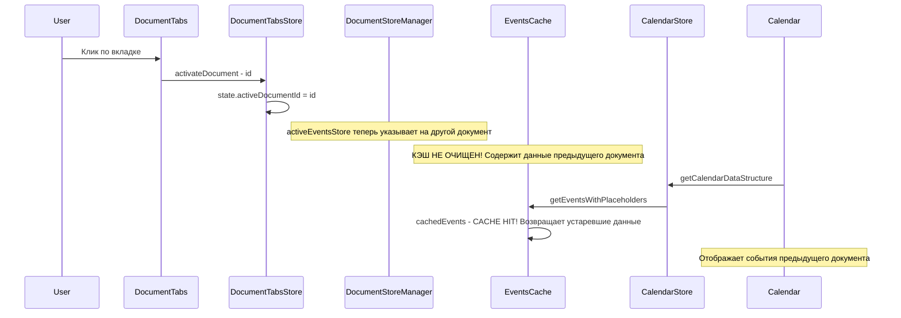
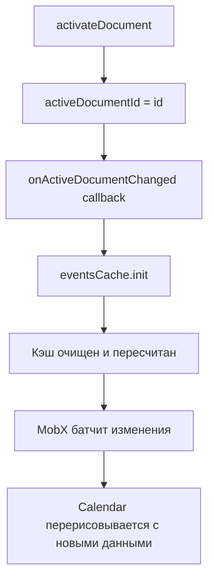

# Анализ бага: Календарь не обновляется при переключении вкладок документов

## Описание проблемы

При открытии нескольких документов и переключении между вкладками, содержимое календаря не изменяется — отображаются события предыдущего документа.

## Корневая причина

Проблема состоит из **двух взаимосвязанных аспектов**:

### 1. `EventsCache` не инвалидируется при смене активного документа

Поток данных при переключении вкладки:



Ключевой момент: метод [`activateDocument()`](src/6-entities/Document/model/DocumentTabsStore.ts:250) устанавливает `activeDocumentId`, но **не вызывает `eventsCache.init()`** для очистки кэша.

Метод [`EventsCache.init()`](src/6-entities/EventsCache/EventsCache.ts:33) очищает внутренние массивы `cachedEvents`, `cachedActualBalance`, `cachedPlannedBalance` и пересчитывает балансные метрики из текущего `activeEventsStore`. Но он вызывается только в следующих случаях:

- При инициализации приложения в [`MainStore.init()`](src/1-app/Stores/MainStore.ts:76)
- При изменении событий через колбэк [`onEventsChanged`](src/1-app/Stores/MainStore.ts:51)
- При изменении проектов через колбэк [`onProjectsChanged`](src/1-app/Stores/MainStore.ts:63)

**При переключении вкладки ни один из этих колбэков не вызывается**, поэтому кэш остаётся заполненным данными предыдущего документа.

### 2. `EventsCache` не является MobX-observable

Класс [`EventsCache`](src/6-entities/EventsCache/EventsCache.ts:12) **не использует** `makeAutoObservable()`. Его внутренние свойства (`cachedEvents`, `lastActualBalance` и др.) — обычные JS-массивы и примитивы, изменения которых MobX не отслеживает.

Это означает, что даже если мы очистим кэш, компонент `Calendar` не узнает об этом автоматически через механизм реактивности MobX. Однако, поскольку `Calendar` уже читает `documentTabsStore.activeEventsStore` (строка 23 в [`Calendar.tsx`](src/3-pages/Calendar/Calendar.tsx:23)), компонент **уже перерисовывается** при смене вкладки. Проблема лишь в том, что при перерисовке `getCalendarDataStructure()` получает устаревшие данные из кэша.

## Предлагаемое решение

### Минимальное исправление: колбэк при смене активного документа

Добавить механизм уведомления о смене активного документа, аналогичный существующему `setOnStoresChanged`, и вызывать `eventsCache.init()` синхронно при смене вкладки.



#### Изменяемые файлы

1. **`DocumentTabsStore.types.ts`** — добавить тип колбэка `onActiveDocumentChanged`
2. **`DocumentTabsStore.ts`** — добавить поле и сеттер для колбэка, вызвать в `activateDocument()`
3. **`MainStore.ts`** — зарегистрировать колбэк, вызывающий `eventsCache.init()`

#### Подробное описание изменений

**Шаг 1: Добавить тип колбэка**

В [`DocumentTabsStore.types.ts`](src/6-entities/Document/model/DocumentTabsStore.types.ts) или в [`DocumentStoreManager.ts`](src/6-entities/Document/model/DocumentStoreManager.ts:10) (рядом с `DocumentStoreCallbacks`):

```ts
export interface DocumentStoreCallbacks {
  onEventsChanged?: (stores: DocumentStores) => void
  onProjectsChanged?: (stores: DocumentStores) => void
  onActiveDocumentChanged?: (documentId: DocumentId) => void  // НОВОЕ
}
```

**Шаг 2: Добавить колбэк в DocumentTabsStore**

В [`DocumentTabsStore.ts`](src/6-entities/Document/model/DocumentTabsStore.ts):

```ts
// Новое поле
private onActiveDocumentChanged?: (documentId: DocumentId) => void

// Новый метод
setOnActiveDocumentChanged(callback: (documentId: DocumentId) => void): void {
  this.onActiveDocumentChanged = callback
}

// В activateDocument() — добавить вызов в конце:
activateDocument(documentId: DocumentId) {
  // ... существующий код ...
  this.state.activeDocumentId = documentId
  // ... существующий код ...
  
  this.onActiveDocumentChanged?.(documentId)  // НОВОЕ
}
```

**Шаг 3: Зарегистрировать колбэк в MainStore**

В [`MainStore.init()`](src/1-app/Stores/MainStore.ts:46):

```ts
init() {
  // Существующие колбэки
  this.documentTabsStore.setOnStoresChanged({ ... })

  // НОВОЕ: инвалидировать кэш при смене активного документа
  this.documentTabsStore.setOnActiveDocumentChanged(() => {
    this.eventsCache.init()
  })

  // ... остальной код ...
}
```

### Почему это работает

1. `activateDocument()` выполняется внутри MobX-действия (благодаря `makeAutoObservable`)
2. Вызов `eventsCache.init()` происходит **синхронно** в том же действии, до того как MobX обработает пакет изменений
3. Когда Calendar перерисовывается (из-за изменения `activeEventsStore`), кэш уже очищен
4. `getEvents()` не находит закэшированных данных и пересчитывает их из нового `activeEventsStore`

### Дополнительное улучшение: сделать EventsCache observable

В будущем рекомендуется сделать [`EventsCache`](src/6-entities/EventsCache/EventsCache.ts) полноценным MobX-observable классом:

- Добавить `makeAutoObservable(this)` в конструктор
- Это обеспечит автоматическую перерисовку компонентов при любых изменениях кэша
- Устранит необходимость в `forceUpdate` и других обходных путях

Однако это более масштабное изменение, требующее аккуратного тестирования производительности (кэш содержит большие массивы данных).

## Затрагиваемые компоненты

| Файл | Изменение |
|------|-----------|
| [`DocumentStoreManager.ts`](src/6-entities/Document/model/DocumentStoreManager.ts) | Добавить `onActiveDocumentChanged` в `DocumentStoreCallbacks` |
| [`DocumentTabsStore.ts`](src/6-entities/Document/model/DocumentTabsStore.ts) | Добавить поле, сеттер и вызов колбэка в `activateDocument()` |
| [`MainStore.ts`](src/1-app/Stores/MainStore.ts) | Зарегистрировать колбэк `eventsCache.init()` |

## Тестирование

После исправления необходимо проверить:

1. Открыть два документа с разными событиями
2. Переключаться между вкладками — календарь должен отображать события активного документа
3. Балансы должны пересчитываться корректно
4. Перетаскивание событий должно работать после переключения вкладки
5. DayList также должен корректно обновляться при переключении
